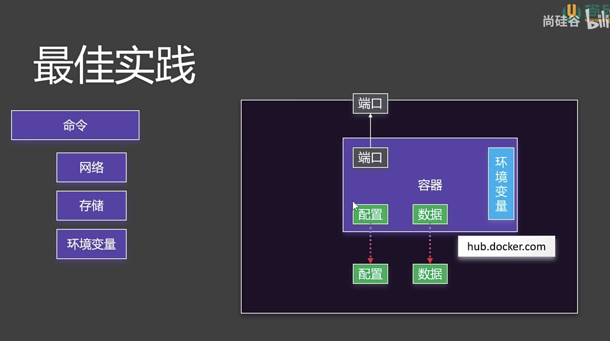

# 安装 Docker
```shell
curl -fsSL https://get.docker.com | bash -s docker --mirror Aliyun

systemctl enable --now docker
```

# 安装 docker-compose
```shell
curl -L https://github.com/docker/compose/releases/download/v2.20.3/docker-compose-`uname -s`-`uname -m` -o /usr/local/bin/docker-compose

chmod +x /usr/local/bin/docker-compose
```

# 验证安装
```shell
docker -v
docker-compose -v
```

# 如失效，自行百度~

# docker镜像配置
```shell
mkdir -p /etc/docker

tee /etc/docker/daemon.json <<-'EOF'
{
  "registry-mirrors": ["https://docker.1ms.run"]
}
EOF

systemctl daemon-reload
systemctl restart docker
```

# docker示意图


# 理解容器


# docker命令
## 镜像
```sh
检索：docker search
下载：docker pull XXX:lastest
列表：docker images
删除：docker rmi
```
## 容器
```sh
运行：docker run
      后台启动并命名：docker run -d --name mynginx nginx
      端口映射（主机端口：容器端口）：docker run -d --name -p 80:80 nginx

查看：docker ps
      docker ps -a
停止：docker stop
启动：docker start
重启：docker restart
状态：docker stats
日志：docker logs
进入：docker exec
      交互模式：docker exec -it mynginx /bin/bash

删除：docker rm
      docker rm -f
```
## 保存镜像
```sh
提交：docker commit -m "提交信息" mynginx(容器) mynginx:v1.0(镜像)
保存：docker save -o mynginx.tar mynginx:v1.0
加载：docker load -i mynginx.tar  (加载成镜像)
```

## 分享社区
```sh
登录：docker login
改名：docker tag mynginx:v1.0 liaoxuan/mynginx:v1.0
      docker tag mynginx:v1.0 liaoxuan/mynginx:latest
推送：docker push liaoxuan/mynginx:v1.0
      docker push liaoxuan/mynginx:latest
```
# docker存储
```sh
目录挂载：docker run -d -p 80:80 -v /app/nghtml:/usr/share/nginx/html --name app01 nginx
卷映射：docker run -d -p 88:80 -v /app/nghtml:/usr/share/nginx/html -v ngconf:/etc/nginx --name app02 nginx
    默认路径：/var/lib/docker/volumes/ngconf/_data
卷操作：docker volume ls
      docker volume create [name]
      docker volume inspect [name] (查看卷详情)
删除容器时，目录和卷都不会被删除
```
# docker网络
```sh
查看容器细节：docker container inspect [容器名]
docker为每一个容器分配唯一ip，使用容器ip+容器端口可以互相访问
ip由于各种原因可能会变化
docker0默认不支持主机域名
创建自定义网络，容器名就是稳定域名。
创建网络：docker network create mynet
查看网络：docker network ls
docker run -d -p 88:80 --name app1 --network mynet nginx
```
# 最佳实践


# docker compose


