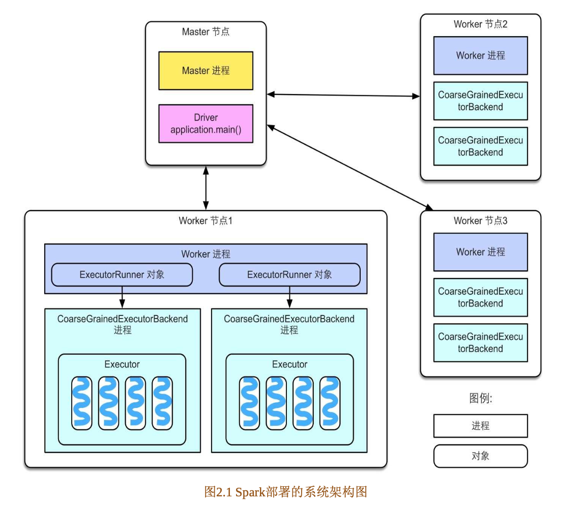

# Spark系统架构
## Master-Worker结构
简单来说，Master节点负责管理应用和任务，Worker节点负责执行任务

- Master节点上常驻Master进程。该进程负责管理全部的Worker节点，如将Spark任务分配给Worker节点，收集Worker节点上任务的运行信息，监控Worker节点的存活状态等。
- Worker节点上常驻Worker进程。该进程除了与Master节点通信，还负责管理Spark任务的执行，如启动Executor来执行具体的Spark任务，监控任务运行状态等。

启动Spark集群时，Master节点上会启动Master进程，每个Worker节点上会启动Worker进程，接下来可以提交Spark应用到集群中执行，Master节点接受到应用后首先会通知Worker节点启动Executor，然后分配Spark计算任务（task）到Executor上执行，Executor接收到task后，为每个task启动1个线程来执行。

- Spark application
  - 即spark应用，指1个可运行的Spark程序，如WordCount.scala，包含了一些配置参数，如需要占用的CPU个数，Executor内存大小等。用户可以使用Spark本身提供的数据操作来实现程序，也可以通过其他框架（如Spark SQL）来实现应用，Spark SQL框架可以将SQL语句转化成Spark程序执行
- Spark Driver
  -  Spark驱动程序，指实际在运行Spark应用中main()函数的进程，运行在Master节点上的Spark应用进程（通常由SparkSubmit脚本产生）就是Spark Driver，Driver独立于Master进程。如果是YARN集群，那么Driver也可能被调度到Worker节点上运行。
  -  简单来说，我们可以在自己的IDEA中运行Spark应用，IDEA会启动一个进程既运行应用程序的main()函数，又运行具体计算任务task，即Driver和task共用一个进程。
-  Executor
   -   Spark执行器，是Spark计算资源的一个单位。Spark先以Executor为单位占用集群资源，然后可以将具体的计算任务分配给Executor执行。
   -    Worker进程实际只负责启停和观察Executor的执行情况
   -    Executor的总内存大小由用户配置，而且Executor的内存空间由多个task共享。
- task
  -  Spark应用的计算任务，Driver在运行Spark应用的main()函数时，会将应用拆分为多个计算任务，然后分配给多个Executor执行。
  -  task是Spark中最小的计算单位，不能再拆分。task以线程方式运行在Executor进程中，执行具体的计算任务，如map算子，reduce算子等。
  -  由于Executor可以配置多个CPU，而1个task一般使用1个CPU，因此当Executor具有多个CPU时，可以运行多个task。
- Worker进程通过持有ExecutorRunner对象管理Executor进程。
- 每个Spark应用启动一个Driver和多个Executor，每个Executor里面运行的task都属于同一个Spark应用。

<key,value>record